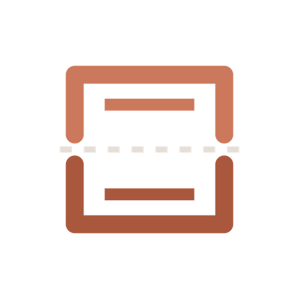

<p align="center">
  
</p>

<h1 align="center">text-rs</h1>

<p align="center">
  A minimal, opinionated desktop text editor built with Tauri 2 and CodeMirror 6.
</p>

<p align="center">
  
  
  
  
  
</p>

<p align="center">
  
  
  
</p>

---

## Features

- **Native feel** — macOS traffic light buttons, native window decorations
- **Multi-tab editing** — create, close, rename, reorder tabs with dirty indicators
- **Syntax highlighting** — 10+ language packs via CodeMirror 6 (Rust, TypeScript, Python, Go, and more)
- **Find & Replace** — regex, case-sensitive, whole-word match support
- **Recent files** — persisted across sessions, accessible from context menu
- **Word wrap toggle** — quick switch with `Alt+Z`
- **Customizable** — font size, tab size, insert spaces preference
- **Warm design** — cream canvas + coral accent inspired by Anthropic's design system
- **Cross-platform** — built on Tauri 2 for macOS, Windows, and Linux

## Tech Stack

| Layer | Technology |
|---|---|
| Desktop runtime | [Tauri 2](https://tauri.app) |
| Frontend | [Svelte 5](https://svelte.dev) + TypeScript |
| Editor engine | [CodeMirror 6](https://codemirror.net) |
| Styling | CSS custom properties (design tokens) |
| Package manager | [bun](https://bun.sh) |
| Language | Rust (backend) + TypeScript (frontend) |

## Getting Started

### Prerequisites

- [Rust](https://rustup.rs/) (latest stable)
- [bun](https://bun.sh/) (`curl -fsSL https://bun.sh/install | bash`)
- [Tauri prerequisites](https://v2.tauri.app/start/prerequisites/)

### Install & Run

```bash
# Clone the repository
git clone https://github.com/suradet-ps/text-rs.git
cd text-rs

# Install dependencies
bun install

# Start dev server
bun run tauri dev
```

### Build

```bash
# Production build (creates .app / .dmg / .exe)
bun run tauri build
```

## Project Structure

```
text-rs/
├── src-tauri/                # Rust backend
│   ├── src/
│   │   ├── commands/         # Tauri IPC commands (file I/O, window)
│   │   ├── state/            # Persistent state (recent files)
│   │   ├── lib.rs            # App builder, plugin registration
│   │   └── main.rs           # Entry point
│   ├── icons/                # App icons (all platforms)
│   └── tauri.conf.json       # Tauri configuration
├── src/                      # Svelte frontend
│   ├── lib/
│   │   ├── components/       # UI components (TabBar, Editor, StatusBar...)
│   │   ├── codemirror/       # Editor setup, themes, language detection
│   │   ├── stores/           # Svelte 5 state (tabs, recent, settings)
│   │   └── utils/            # Helpers (language detection, path formatting)
│   └── routes/               # Page routes
├── DESIGN.md                 # Design tokens & visual system
├── AGENTS.md                 # Full spec & architecture docs
└── scripts/                  # Build scripts (icon generation)
```

## Keyboard Shortcuts

| Shortcut | Action |
|---|---|
| `Ctrl+N` | New tab |
| `Ctrl+O` | Open file |
| `Ctrl+S` | Save |
| `Ctrl+Shift+S` | Save As |
| `Ctrl+W` | Close tab |
| `Ctrl+Tab` | Next tab |
| `Ctrl+Shift+Tab` | Previous tab |
| `Ctrl+F` | Find |
| `Ctrl+H` | Find & Replace |
| `Ctrl+G` | Go to line |
| `Alt+Z` | Toggle word wrap |
| `Ctrl++` / `Ctrl+-` | Zoom in / out |
| `Ctrl+0` | Reset zoom |

## Development

```bash
# Type check
bun run check

# Lint Rust code
cd src-tauri && cargo clippy

# Run tests
cd src-tauri && cargo test

# Regenerate app icons
node scripts/gen-icons.cjs
```

## Contributing

Contributions are welcome! Please feel free to submit a Pull Request.

1. Fork the repository
2. Create your feature branch (`git checkout -b feat/amazing-feature`)
3. Commit your changes (`git commit -m 'feat: add amazing feature'`)
4. Push to the branch (`git push origin feat/amazing-feature`)
5. Open a Pull Request

## License

This project is licensed under the MIT License — see the [LICENSE](LICENSE) file for details.
